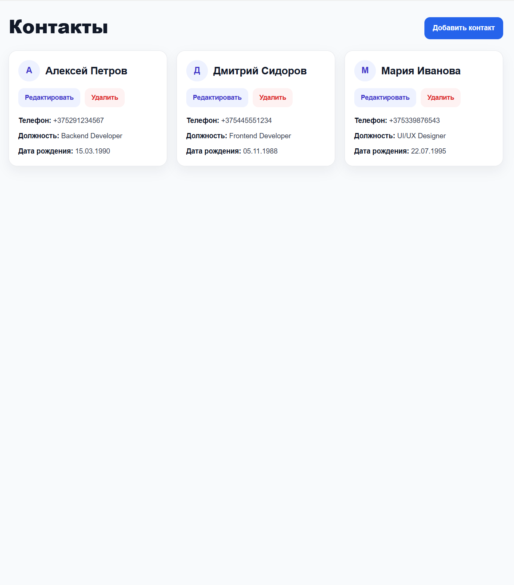
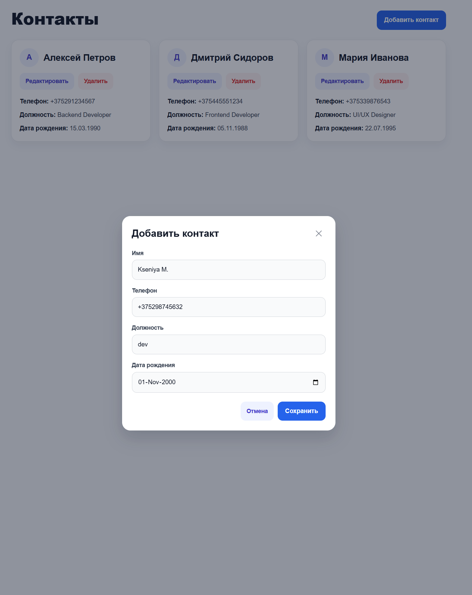
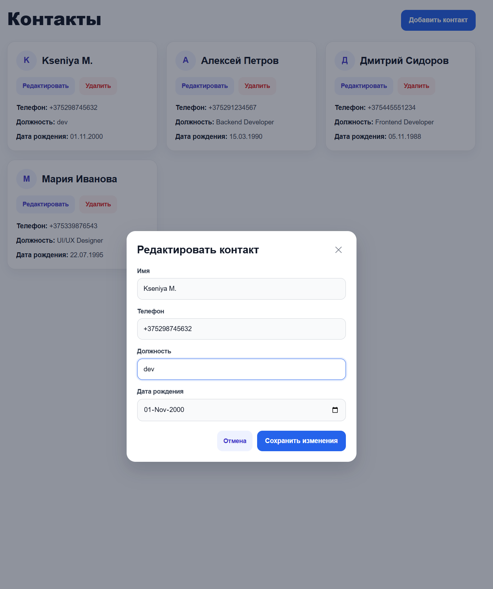
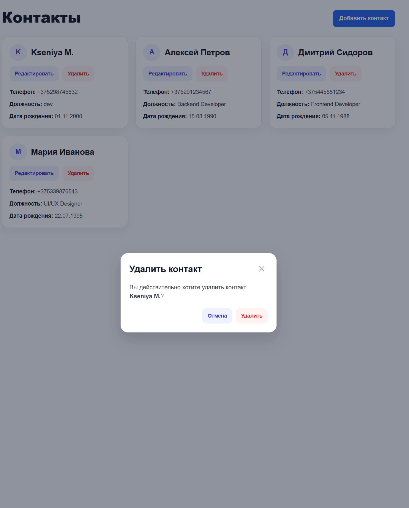

# ContactBook

ContactBook — это одностраничное веб-приложение для управления контактами, разработанное на ASP.NET Core и React.

## Возможности

- Просмотр списка контактов
- Добавление нового контакта
- Редактирование существующего контакта
- Удаление контакта с подтверждением
- Валидация данных на стороне клиента
- Работа с базой данных PostgreSQL

## Используемые технологии

### Backend

- ASP.NET Core Web API
- Entity Framework Core
- PostgreSQL

### Frontend

- React
- TypeScript
- Vite
- CSS

## Поля контакта

Каждый контакт содержит:

- Name
- MobilePhone
- JobTitle
- BirthDate

## Интерфейс

- Все контакты отображаются на одной странице
- Добавление и редактирование реализованы через модальные окна
- Удаление сопровождается подтверждением
- Реализована клиентская валидация введённых данных

## Скриншоты

### Список контактов



### Добавление контакта



### Редактирование контакта



### Удаление контакта



## Запуск проекта

### Backend

1. Открыть серверный проект
2. Указать строку подключения к PostgreSQL в `appsettings.json`
3. Применить миграции:
   ```bash
   Update-Database
   ```
4. Запустить ASP.NET Core API

### Frontend

1. Перейти в папку клиентского приложения
2. Установить зависимости:
   ```bash
   npm install
   ```
3. Запустить проект:
   ```bash
   npm run dev
   ```

## Описание проекта

В рамках проекта было разработано CRUD-приложение для работы с контактами.  
На серверной стороне реализован Web API для создания, чтения, редактирования и удаления контактов.  
На клиентской стороне создан интерфейс со списком контактов и модальными окнами для добавления и редактирования записей.  
Также реализована JavaScript-валидация введённых пользователем данных.
